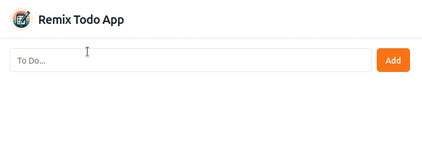

# Remix Todo App

Simple todo app built with Remix and Drizzle ORM, powered by Cloudflare Pages and D1



## Stacks

- Cloudflare [Pages](https://pages.cloudflare.com/) + [D1](https://developers.cloudflare.com/d1/)
- [Remix](https://remix.run/)
- [Drizzle ORM](https://orm.drizzle.team/)
- [remix-auth](https://github.com/sergiodxa/remix-auth), [remix-auth-discord](https://github.com/JonnyBnator/remix-auth-discord)
- [CONFORM](https://conform.guide/)
- [shadcn/ui](https://ui.shadcn.com/), [Tailwind CSS](https://tailwindcss.com/)

## Development

### Setup Discord OAuth

First go to [the Discord Developer Portal](https://discord.com/developers/applications) to create a new application and get a client ID and secret. The client ID and secret are located in the OAuth2 Tab of your Application. Once you are there you can already add your first redirect URI.
Add a redirect URI `http://localhost:8788/auth/discord/callback` for local development.

You can find the detailed Discord OAuth Documentation [here](https://discord.com/developers/docs/topics/oauth2#oauth2).

### Add enviroment variables, bindings

Copy `.dev.vars.example` to `.dev.vars`.

```sh
cp .dev.vars.example .dev.vars
```

Edit the value of `SESSION_SECRET` and fill in the values for your Discord OAuth application.

```sh
SESSION_SECRET="YOUR_SESSION_SECRET"
DISCORD_AUTH_CLIENT_ID="YOUR_DISCORD_CLIENT_ID"
DISCORD_AUTH_CLIENT_SECRET="YOUR_DISCORD_CLIENT_SECRET"
```

Copy `wrangler.toml.example` to `wrangler.toml`.

```sh
cp wrangler.toml.example wrangler.toml
```

Edit the value of `database_id` if you going to deploy to Cloudflare Pages.

```toml
database_id = "YOUR_CLOUDFLARE_D1_DATABASE_ID"
```

### Install dependencies and migrate database

```sh
npm install
npm run local:d1:migrations:apply
```

### Start devlopment server

You will be utilizing Wrangler for local development to emulate the Cloudflare runtime. This is already wired up in your package.json as the `dev` script:

```sh
# start the remix dev server and wrangler
npm run dev
```

Open up [http://127.0.0.1:8788](http://127.0.0.1:8788) and you should be ready to go!

## Deployment

Cloudflare Pages are currently only deployable through their Git provider integrations.

If you don't already have an account, then [create a Cloudflare account here](https://dash.cloudflare.com/sign-up/pages) and after verifying your email address with Cloudflare, go to your dashboard and follow the [Cloudflare Pages deployment guide](https://developers.cloudflare.com/pages/framework-guides/deploy-anything).

Configure the "Build command" should be set to `npm run build`, and the "Build output directory" should be set to `public`.

## Inspiration

- [remix-d1-bullets](https://github.com/mizchi/remix-d1-bullets)
